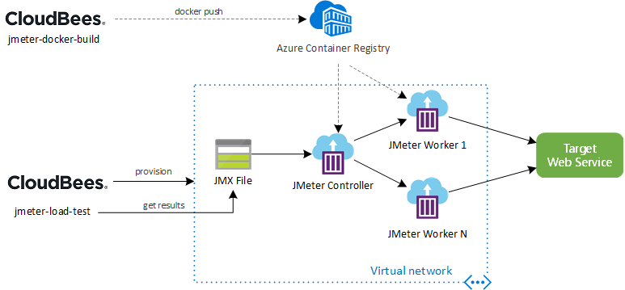

# Microsoft Azure Government (MAG) Load Testing Pipeline with JMeter, ACI and Terraform

This project is a load testing pipeline that leverages [Apache JMeter](https://jmeter.apache.org/) as an open source load and performance testing tool and [Terraform](https://www.terraform.io/)to dynamically provision and destroy the required infrastructure on MAG.

This solution is developed by Microsoft, and customized by CMS Cloud so that the testing can be triggered from the CloudBees CI Jenkins pipeline.

## Key concepts



The flow is triggered and controlled by an CloudBees CI pipeline. The pipeline contains a set of tasks that are organized logically in `SETUP`, `TEST`, `RESULTS` and `TEARDOWN` groups.

| Task group              | Tasks  |
|-------------------------|--------|
| SETUP | <li>Validate the JMX file that contains the JMeter test definition</li><li>Upload JMeter JMX file to Azure Storage Account File Share</li><li>Provision the infrastructure with Terraform</li> |
| TEST | <li>Run JMeter test execution and wait for completion</li> |
| RESULTS | <li>Show JMeter logs</li><li>Get JMeter artifacts (e.g. logs, dashboard)</li><li>Publish JMeter artifacts to CloudBees Pipelines</li> |
| TEARDOWN | <li>Destroy all ephemeral infrastructure with Terraform</li> |

On the `SETUP` phase, JMeter agents are provisioned as [Azure Container Instance (ACI)](https://azure.microsoft.com/en-us/services/container-instances/) using a [custom Docker image](./docker/Dockerfile) on Terraform. Through a [Remote Testing](https://jmeter.apache.org/usermanual/remote-test.html) approach, JMeter controller is responsible to configure all workers, consolidating all results and generating the resulting artifacts (dashboard, logs, etc).

The infrastructure provisioned by Terraform includes:

* Resource Group
* Virtual Network (VNet)
* Storage Account File Share
* 1 JMeter controller on ACI
* N JMeter workers on ACI

On the `RESULTS` phase, a JMeter report file (results.jtl) is published in the end of each load testing execution.

## Prerequisites

Access to [CMS Cloud MAG Load Testing](https://github.com/CMSgov/cmscloud-infra-mag-jmeter-aci) repository.

Access to Cloudbees Jenkins instance.

_Azure subscription_ for creating and tearing down the load-test solution.

Installation of [Azure Credentials](https://plugins.jenkins.io/azure-credentials/) plugin to the Jenkins instance.

[Azure Service Principal](https://docs.microsoft.com/en-us/azure/active-directory/develop/app-objects-and-service-principals#service-principal-object) for Azure access.

[Azure Container Registry (ACR)](https://azure.microsoft.com/en-us/services/container-registry/) with Admin user enabled. 
- Set the ACR Name as `jmeteraci`
- Set the ACR Resource Group name as `jmeter-aci-group` 

Jenkins Managed Credentials
- `mag` : Azure Service Principle (Kind: Azure Credential)
- `mag-acr` : The credential for ACR (Kind: Username with password)


## Getting Started

### 1. Fork this repository

A fork is a copy of a repository. Forking a repository allows you to freely experiment with changes without affecting the original repository. Please follow the [Fork a repo]( https://docs.github.com/en/get-started/quickstart/fork-a-repo) instruction and fork the following repository:

- https://github.com/CMSgov/cmscloud-infra-mag-jmeter-aci

### 2. Create Jenkins pipeline jobs

Log on to the Jenkins instance

Create 'jmeter-docker-build' pipeline job as below :
```
Pipeline
  Definition : Pipeline script from SCM
	SCM : Git 
	  Repositories
	    Repository URL : https://github.com/CMSgov/cmscloud-infra-mag-jmeter-aci (or your forked repository)
		Credentials : (your credential to https://github.com/CMSgov)
	  Branches to build
		Branch Specifier : */main
	Script Path : jenkins/docker-jmeter/Jenkinsfile
```

Create 'jmeter-load-test' pipeline job as below:
```
Pipeline
  Definition : Pipeline script from SCM
	SCM : Git 
	  Repositories
	    Repository URL : https://github.com/CMSgov/cmscloud-infra-mag-jmeter-aci (or your forked repository)
		Credentials : (your credential to https://github.com/CMSgov)
	  Branches to build
		Branch Specifier : */main
	Script Path : jenkins/load-test/Jenkinsfile
```

### 3. Updating the JMX test definition (optional)

By default the test uses [`sample.jmx`](./jmeter/sample.jmx). This JMX file contains a test definition for performing HTTP requests on `azure.microsoft.com` endpoint through the `443` port. You can simply update the it with the test definition of your preference.

### 4. Build the JMeter Docker image 

Trigger 'jemter-docker-build' pipeline job. The job builds and pushes JMeter Docker image to Azure Container Registry

### 5. Run the test

Trigger 'jemter-load-test' pipeline job. The job requires following parameters:
- `ACR_NAME` : Name of ACR created for the load test (Default: jmeteraci)
- `ACR_RESOURCE_GROUP` : Name of ACR Resource Grouup created for the load test (Default: jmeter-aci-group)
- `WORKS_COUNT`: Number of containers to generate synthetic loads (Default: 1)


## Viewing Test Results

JMeter test results are created in a [JTL](https://cwiki.apache.org/confluence/display/JMETER/JtlFiles) file (`results.jtl`) with CSV formatting. The file is published upon completion of the load test execution. 

## Pipeline Configuration

All Terraform parameters can be configured using the Variable Group `JMETER_TERRAFORM_SETTINGS`. Please read [JMeter Pipeline Settings](./docs/jmeter-pipeline-settings.md) to know more details about it.

## Limitations

* **Load Test duration**
Please note that for [Microsoft hosted agents](https://docs.microsoft.com/en-us/azure/devops/pipelines/agents/hosted?view=azure-devops#capabilities-and-limitations), you can have pipelines that runs up to 1 hour (private project) or 6 hours (public project). You can have your own agents to bypass this limitation.

* **ACI on VNET regions**
Please note that [not all regions](https://docs.microsoft.com/en-us/azure/container-instances/container-instances-virtual-network-concepts#where-to-deploy) currently support ACI and VNET integration. If you need private JMeter agents, you can deploy it in a different region and use VNET peering between them. Also note that vCPUs and memory limits change based on regions.

## Additional Documentation

* [Implementation Notes](./docs/implementation-notes.md)
* [Adding plugins to JMeter Docker image](./docs/adding-jmeter-plugins.md)
* [JMeter pipeline settings](./docs/jmeter-pipeline-settings.md)
* [Estimating costs](./docs/estimating-costs.md)
* [Integrating with Application Insights](./docs/integrating-application-insights.md)

## External References

* [User Manual: Remote Testing](https://jmeter.apache.org/usermanual/remote-test.html)
* [User Manual: Apache JMeter Distributed Testing Step-by-step](https://jmeter.apache.org/usermanual/jmeter_distributed_testing_step_by_step.html)
* [Azure DevOps CLI reference](https://docs.microsoft.com/en-us/cli/azure/ext/azure-devops/?view=azure-cli-latest)

## Contributing

This project welcomes contributions and suggestions.  Most contributions require you to agree to a
Contributor License Agreement (CLA) declaring that you have the right to, and actually do, grant us
the rights to use your contribution. For details, visit https://cla.opensource.microsoft.com.

When you submit a pull request, a CLA bot will automatically determine whether you need to provide
a CLA and decorate the PR appropriately (e.g., status check, comment). Simply follow the instructions
provided by the bot. You will only need to do this once across all repos using our CLA.

This project has adopted the [Microsoft Open Source Code of Conduct](https://opensource.microsoft.com/codeofconduct/).
For more information see the [Code of Conduct FAQ](https://opensource.microsoft.com/codeofconduct/faq/) or
contact [opencode@microsoft.com](mailto:opencode@microsoft.com) with any additional questions or comments.
